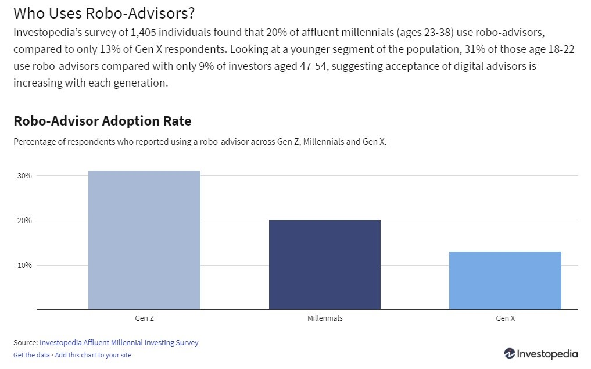
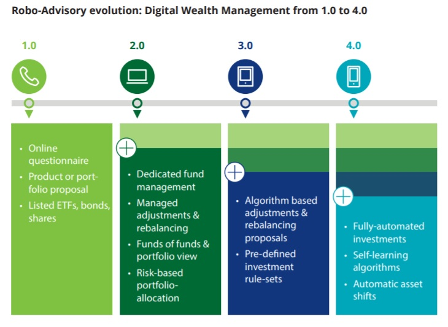
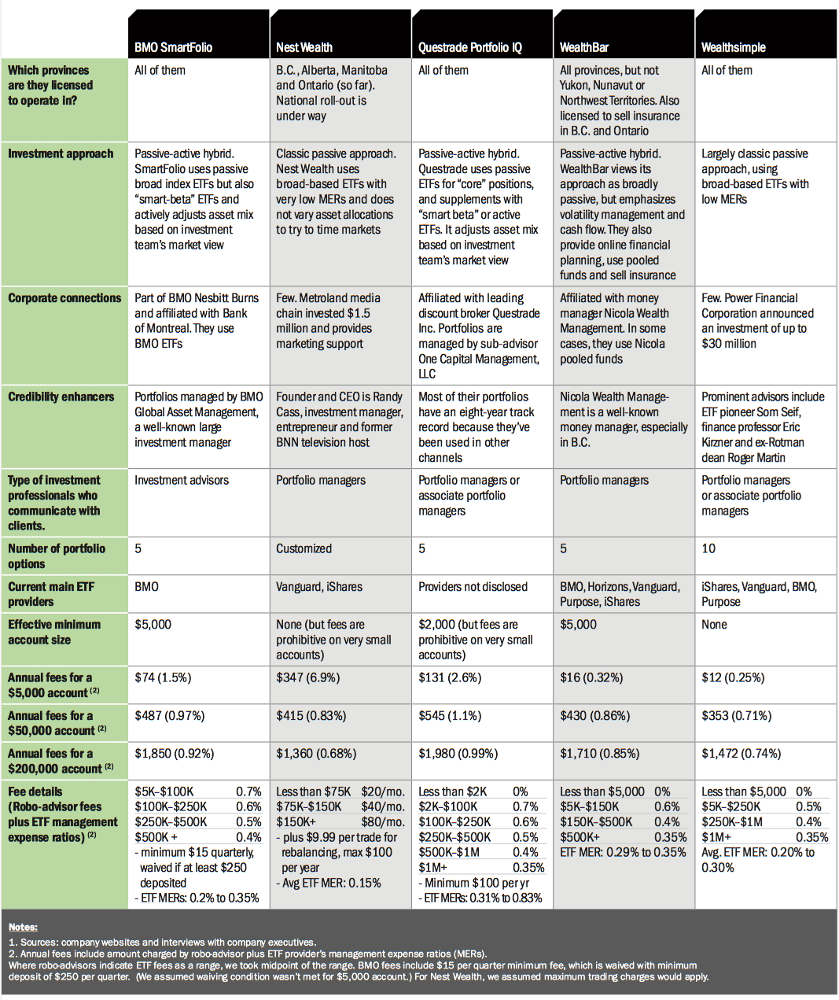

# 01_Intro_to_Fintech_Homework_Assignment
# Unit 1 Homework Assignment: FinTech Case Study

## Wealthsimple - Changing the Landscape of RoboAdvising in Canada

### Overview and Origin

* `Name of the company`
    - [**Wealthsimple Technologies Inc.**](https://www.wealthsimple.com/)

    

* `When was the company incorporated?`
    - September 2014

* `Who are the founders of the company?`
     - Micheal Katchen and Rudy Adler

* `How did the idea for the company (or project) come about?`
    - After graduating from university, Katchen worked for global consulting firm McKinsey and later joined 1000memories. Ancestry.com bought 1000memories in 2012, providing Katchen and his colleagues with an undisclosed cash windfall. **Shortly after, Katchen developed an Excel spreadsheet with tips to help his colleagues and friends set up “thoughtful” investment portfolios.That was the kernel of the idea for Wealthsimple.** He returned to Toronto in 2014 and raised $2 million in just 2½ weeks and launched his startup in September.

* `How is the company funded? How much funding have they received?`
    - Wealthsimple has raised a total of CA$266.9M in funding over 7 rounds. Their latest funding was raised on May 22, 2019 from a Undisclosed round for about CA$100M
    - Key Owner/ Investor - *Power Corporation*
---
### Business Activities

* `What specific financial problem is the company or project trying to solve?`
    - Wealthsimple falls in the category of Robo-advisors. Robo-advisors are digital platforms that provide automated, algorithm-driven financial planning services with little to no human supervision. The differenciating factor between a Robo-advisor and tradional banks/ financial advisors is the low cost solutions offered by Robo-advisors. They are trying to disrupt the market by providing more benefits for a less cost.

* `Who is the company's intended customer?  Is there any information about the market size of this set of customers?`
    - The founders of Wealthsimple initially didn't plan to market to an older generation. Instead, as millennials werthemselves, they were looking to fill a gap they saw within their 25-to-30 age group when it came to investing. But since launching in 2012, the company has seen a shift in its user base with more Gen X clients – the generation preceding millennials – setting up accounts, as well as boomers who are hearing from their children about the online wealth managers who can save them money.
    

* `What solution does this company offer that their competitors do not or cannot offer? (What is the unfair advantage they utilize?)`
    - The main offering of Wealthsimple is gradual wealth building at a low cost. They do this by passive investing - They mirror the market rather than actively try to beat it. Studies have shown that in the long run, passive investing has provided considerably better returns compared to actively managed portfolios. While it may not be termed as an unfair advantage, the fact that Wealthsimple has no brick and mortar offices and everything is done online or via phone or email, they are able to reduce the operating expenses a great deal. This benefit is then passed on to client in the form of lower fees as compared to tradional banks and investment houses.

* `Which technologies are they currently using, and how are they implementing them?`
    - The 3 main layers of any fintech techonolgy setup comprise the Front End, Back End and Data Storage. Wealthsimple uses the below technologies for each layer
        - Front End - AngularJS by Google
        - Back End - Java
        - Data Storing - MySQL
---
### Landscape

* `What domain of the financial industry is the company in?`
    - **Wealthsimple falls under the Robo-Advisor domain which broadly fall under the wealth and investment management segment.** A robo-advisor is a service that uses sophisticated software (and often some real people, too) to decide what types of investments you should be making and then tinker with those investments as time goes on. Even the most traditional investment management firms use algorithms to help them advise clients and balance portfolios. What robo-advising does is make that kind of automation available to the consumer directly. Some robo-advisors offer no living, breathing financial advisors at all, though most do. Because of the minimal involvement of humans, the cost of a robo-advisor is typically less expensive than a brick-and-mortar bank. Robo-advisors have become an increasingly popular way to manage personal finances and investments in Canada. 

* `What have been the major trends and innovations of this domain over the last 5-10 years?`

 - Roboadvisory has boradly followed a 4 step evolution over the years. Each step has seen techological advances leading to higer sophestication and greater automation.
    

* `What are the other major companies in this domain?`
    - The major players in this domain in Canada include but are not limited to:
        - [Nest Wealth](https://www.nestwealth.com/)
        - [Wealthbar](https://www.wealthbar.com/)
        - [Justwealth](https://www.justwealth.com/)
        - [ModernAdvisor](https://www.modernadvisor.ca/)
---
### Results

* `What has been the business impact of this company so far?`

* `What are some of the core metrics that companies in this domain use to measure success? How is your company performing, based on these metrics?`
    - Some of the core metrics used based on weighted average are as follows - 
        - investment selection
        - customer support
        - account fees
        - account minimum
        - trading costs
        - assets under management
        - advisory fees
        - branch access
        - user-facing technology

* `How is your company performing relative to competitors in the same domain?`
    - Below is a competition analyis report based on the factors listed above
        
---
### Recommendations

* `If you were to advise the company, what products or services would you suggest they offer?`
    - While Wealthsimple is the market pioneer in offering alternate investment products such as Halal Investing and Socially Responsible Investing, they could gain a higher percentage of market share by reducing their fees. Price point is always a consideration for gaining new clients and the higher fees compared to peers could deter market penetration. Also they could target different segments of customers apart from millenials who are their primary focus. Having some older generation clients would help them grow their AUM since millenials may not always bring siginificant investment volume and at the end of the day this sector is all about business volume.

* `Why do you think that offering this product or service would benefit the company?`
    - The benefits have been enumerated in the point above.

* `What technologies would this additional product or service utilize?`
    - The best part of these recommendations is that they are from the business strategy standpoint as against a techology standpoint. These services required higher investment in marketing and branding and do not require significant changes in technologies. All in all these slight modifications would enable Wealthsimple to become a market leader in the robo-advisory space.
---
### Sources:
* wikipedia - https://en.wikipedia.org/wiki/Financial_technology
* Wealthsimple - https://www.wealthsimple.com/en-ca/
* NerdWallet - https://www.nerdwallet.com/best/investing/robo-advisors
* Investopedia - https://www.investopedia.com/terms/r/roboadvisor-roboadviser.asp
* Globe and Mail - https://www.theglobeandmail.com/globe-investor/funds-and-etfs/etfs/older-investors-turning-to-robo-advisers-to-reach-their-financial-goals/article36752258/
* Investopdeia - https://www.investopedia.com/study-affluent-millennials-are-warming-up-to-robo-advisors-4770577
* Money sense - https://www.moneysense.ca/save/investing/etfs/which-robo-advisor-is-right-for-you/
